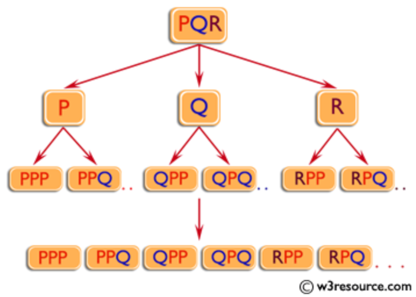
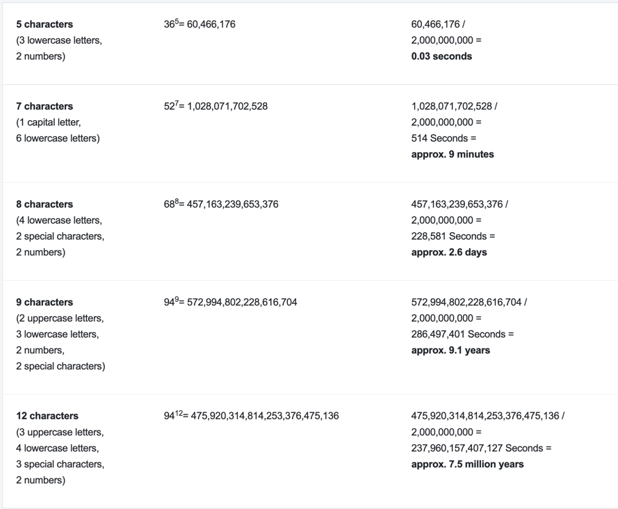

# Getting Started

## Objective
Crack a file with password using brute force algorithm.

#Brute force algorithm
This video is for educational purposes, we are not responsible for the use.

##Theory
Brute force algorithm will iterate all possible combinations from an input charset until it crack the password or reach combination limit.

#### Disadvantages
- It is an inefficient, it is necessary to visit each state (character and/or combination) and solution could be the worst case scenario.
- It is slow.
- It has a creativity lack.

#### Improvements
- Have a word dictionary.
- Define input charset -> Only lower case, upper case, digits, password length.
- Create a clone the file and execute the program 2 or more times, wait that sounds like...
- Multithreading.

#### Alternatives
- Several applications -> John the ripper, Rainbow crack, etc.

### Brute force Example
#### 4 digits password
- 4 digits using only numbers (0-9)
```
0001, 0002, 0003
10 ^ 4 = 10,000 tries
```
- 4 digits letters
```
a, b, c.... z
aa, ab, ac, ad, ae, af, ag... az
aaa, aab, aac, aad... aaz
aaaa, aaab, aaac, aaad.... aaaz
ba, bb, bc, bd, be, bf, bg... bz
baa, bab, bac, bad... baz
bbbb, baab, baac, baaad... baaaz
ca, cb, cc, cd....
```
* Only lower cases -> `26 ^ 4 = 456,976`
* Lower cases + upper cases -> `52 ^ 4 = 7,311,616`
* Lower cases + upper cases + digits (0-9) -> `62 ^ 4 = 14,776,336`

### Big O
Big O (m ^ n)
- m → Input charset length.
- n → Max number of digits in the password.

### Tree representation



## Time
When creating a password, the following characters are usually available:

- Numbers (10 different: 0-9)
- Letters (52 different: A-Z and a-z)
- Special characters (32 different).

The number of possible combinations is calculated using the following formula:

**Possible combinations = possible number of charactersPassword length**

This results in the following calculation examples without considering other factors, such as dictionary attacks:



You can see very clearly the impact of the length of the password and the use of different character groups on the security of a password.
[Source: Password Depot](https://www.password-depot.de/en/know-how/brute-force-attacks.htm)


## Author
Contributors and contact info  
Gustavo Leyva
* [Twitter](https://twitter.com/ovatleyva)
* [GitHub](https://github.com/gusleyva)
* [c4cydonia](https://c4cydonia.netlify.app/)